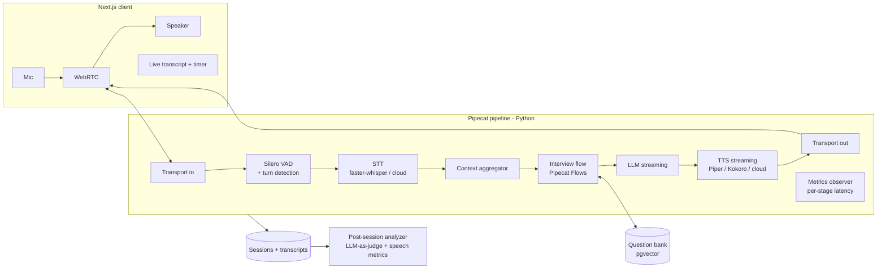

# 6. `interview-voice-coach`: Real-Time Voice Interviewer

> **Difficulty:** Medium-high · **Time:** 2–3 weeks · **Skills:** Real-time voice agents, streaming, latency optimization, conversation state machines, LLM-as-judge, RAG

---

## 1. Summary

A voice interviewer that **talks with you** in the browser. Interviews are in English, for roles like AI Engineer or Backend. It:

- Builds a question plan from the role, level and (optionally) a job posting.
- Asks questions, listens to your answers, and asks a follow-up if you missed a key point.
- Lets you interrupt it mid-sentence (barge-in), like a real interview.
- Produces a report at the end:
  - A score for each answer, based on a rubric
  - Missed key points
  - Speaking pace, filler words (um, like) and pauses
  - Your progress across sessions

### Key message for the README

> "A voice agent with sub-1.5-second latency, measured per stage, and answer scoring validated against human ratings."

---

## 2. Scope

### MVP

- Real-time voice conversation in the browser (WebRTC)
- VAD and turn-taking, with barge-in
- Interview flow with states: intro, questions with at most one follow-up each, and wrap-up
- Question bank with rubrics (key points for each answer)
- Question selection with RAG, based on role, level and job posting
- Post-session report: scores, missed points and speech metrics
- Saved sessions and a progress chart

### Optional

- Behavioral interview mode with STAR-structure scoring
- Connect to `job-fit-agent`, so identified gaps become interview questions
- Tone or sentiment analysis

---

## 3. Architecture



### Pipecat pipeline

```python
pipeline = Pipeline([
    transport.input(),
    stt,                         # WhisperSTTService (local) or cloud STT
    context_aggregator.user(),
    llm,                         # OpenAI-compatible (DeepSeek/GLM)
    tts,                         # Piper (local) or cloud TTS
    transport.output(),
    context_aggregator.assistant(),
])
```

- **Transport:** `SmallWebRTCTransport` for local runs with no external service, or Daily for deployment
- **VAD:** `SileroVADAnalyzer`, plus end-of-turn detection so long answers with pauses aren't cut off
- **Interview flow:** Defined with Pipecat Flows. Each state has its own prompt and tools:
  - `intro`: introduction, asks for role and level
  - `ask_question`: the `next_question()` tool fetches the next question from the bank
  - `follow_up`: the LLM compares the answer to the rubric and asks one follow-up if a key point is missing
  - `wrap_up`: thanks and ends the session
- **Post-session report:** Processed asynchronously from the full timestamped transcript

---

## 4. Latency Budget (end of user speech to start of agent audio)

| Stage | Target |
|---|---|
| End-of-turn detection (VAD and turn) | ~300–500 ms |
| STT (final) | ~200–400 ms |
| LLM: time to first token | ~300–700 ms |
| TTS: first audio byte | ~100–300 ms |
| **Total** | **p50 < 1.5 s, p95 < 2.5 s** |

### Latency reduction techniques (each reported with numbers in the README)

- Streaming at every stage: the LLM feeds TTS sentence by sentence
- Prefetch the next question while the user is still talking
- Short interviewer turns: at most 2–3 sentences
- Compare local and cloud STT/TTS

---

## 5. Question Bank and Rubrics

```yaml
- id: rag-001
  role: [ai-engineer]
  level: [mid, senior]
  topic: rag
  question: "How would you evaluate the retrieval quality of a RAG system?"
  key_points:
    - "Recall@k / Precision@k on labeled query-doc pairs"
    - "MRR or nDCG for ranking quality"
    - "Building a golden dataset (synthetic + human-verified)"
    - "Separating retrieval eval from generation eval (faithfulness)"
  follow_ups:
    - "How would you build the labeled dataset if you had none?"
  difficulty: 3
```

- **MVP content:** about 120 questions across Python, ML basics, LLMs and transformers, RAG, agents, evaluation, system design, MLOps and behavioral
- **Question selection:** embed the job posting and role, search the bank, and diversify topics with MMR
- **Generating new questions (optional):** the LLM creates questions and rubrics from the posting, tagged as "generated"

---

## 6. Post-Session Analysis

### Per answer (LLM-as-judge)

```python
class AnswerScore(BaseModel):
    question_id: str
    covered_points: list[str]
    missed_points: list[str]
    correctness: int = Field(ge=1, le=5)
    depth: int = Field(ge=1, le=5)
    structure: int = Field(ge=1, le=5)      # clear, logical, STAR for behavioral
    communication: int = Field(ge=1, le=5)
    better_answer_outline: str
```

### Speech metrics (computed in code from word timestamps)

- Speaking pace: words per minute (WPM)
- Filler words per minute: um, uh, like, you know, basically
- Long pauses (over 3 seconds) and response delay after each question
- Ratio of user talk time to interviewer talk time

**Important technical note:** Whisper drops filler words (um and uh) by default. To count them:

- Pass an `initial_prompt` that contains these words, and enable `word_timestamps=True`.
- Measure counting accuracy on 20 labeled clips and report it honestly.

---

## 7. Tech Stack

| Layer | Tools |
|---|---|
| Voice framework | Pipecat, and Pipecat Flows |
| Transport | SmallWebRTCTransport (local) or Daily (deployment) |
| VAD | Silero VAD |
| STT | faster-whisper (local), or Deepgram for comparison |
| LLM | DeepSeek or GLM (OpenAI-compatible), with streaming |
| TTS | Piper or Kokoro (local), or a cloud TTS for comparison |
| Backend | FastAPI (session creation, reports and history) |
| Frontend | Next.js, `@pipecat-ai/client-js` and `client-react`, Tailwind and Recharts |
| DB | PostgreSQL + pgvector (question bank, sessions and transcripts) |
| Embeddings | `bge-m3` |
| Eval | DeepEval, scipy (Spearman and kappa) |
| Tracing | Langfuse, and Pipecat metrics |
| Infrastructure | Docker Compose, GitHub Actions |

---

## 8. Repo Structure

```
interview-voice-coach/
├── server/
│   ├── bot.py                 # Pipecat pipeline
│   ├── flows/
│   │   ├── interview_flow.py  # states: intro → question → follow_up → wrap_up
│   │   └── tools.py           # next_question, record_answer, end_interview
│   ├── services.py            # STT/LLM/TTS factory (local vs cloud via env)
│   ├── metrics_observer.py    # per-stage latency logging
│   ├── api.py                 # FastAPI: sessions, reports
│   ├── analysis/
│   │   ├── judge.py           # rubric scoring
│   │   └── speech_metrics.py  # WPM, fillers, pauses
│   └── question_bank/
│       ├── questions.yaml
│       └── retriever.py
├── client/                    # Next.js
│   ├── app/interview/page.tsx
│   └── app/report/[id]/page.tsx
├── eval/
│   ├── latency_bench.py
│   ├── judge_agreement/       # 30 recorded answers + human scores
│   └── filler_clips/
├── docker-compose.yml
└── README.md
```

---

## 9. Evaluation

| Metric | Method | Target |
|---|---|---|
| Voice-to-voice latency | 100 conversation turns, p50 and p95 per stage | p50 < 1.5 s |
| Barge-in | Interrupt the agent 20 times | Agent audio stops in under 300 ms |
| Judge agreement | 30 recorded answers scored by you or a colleague | Spearman ≥ 0.7 |
| Key-point detection | Same 30 answers, comparing covered points with human labels | F1 ≥ 0.8 |
| Filler count accuracy | 20 labeled clips | Reported |
| Follow-up relevance | 50 incomplete answers: did the follow-up target the missing point? | ≥ 80% |
| Cost per session | 20-minute session, local and cloud modes | Reported |

**Charts for the README:**

- Latency by stage, local vs. cloud
- Judge scores vs. human scores (scatter)

---

## 10. Timeline

### Week 1: voice pipeline

| Day | Work |
|---|---|
| 1 | Repo, Docker, and a first echo pipeline (STT to TTS) with SmallWebRTC |
| 2 | Connect the LLM, context and barge-in, plus a simple Next.js client |
| 3 | Metrics observer, latency measurement and first optimizations |
| 4 | Question bank (YAML, first ~60 questions), embeddings and retriever |
| 5 | Pipecat Flows: intro, question, follow-up and wrap-up |

### Week 2: analysis and UI

| Day | Work |
|---|---|
| 6 | Save sessions and timestamped transcripts |
| 7 | Judge and rubrics, and speech metrics |
| 8 | Report page and progress chart |
| 9 | Grow the bank to 120 questions, and add job-posting mode |
| 10 | Record 30 answers and score them by hand |

### Week 3: eval and release

| Day | Work |
|---|---|
| 11 | Latency benchmark, local vs. cloud |
| 12 | Judge agreement, filler accuracy and follow-up relevance |
| 13 | Fixes and results table |
| 14 | README, demo video (audio matters, so a GIF isn't enough), CI and LinkedIn post |

---

## 11. Definition of Done

- [ ] A full 10-minute interview runs in the browser without dropouts
- [ ] Barge-in works
- [ ] p50 latency is under 1.5 seconds, with the per-stage chart in the README
- [ ] The post-session report includes scores, missed points and speech metrics
- [ ] Judge agreement is reported with numbers in the README
- [ ] The demo video is published

---

## 12. Risks

| Risk | Mitigation |
|---|---|
| High latency from local STT and TTS on CPU | Smaller models, quantization, or cloud mode for the demo |
| Long answers with pauses get cut off early | Tune the VAD threshold, and use smart turn detection |
| Judge disagrees with humans | Detailed rubrics with key points, few-shot examples, and honest reporting |
| WebRTC issues behind NAT | Use a TURN server or Daily for public deployment |
